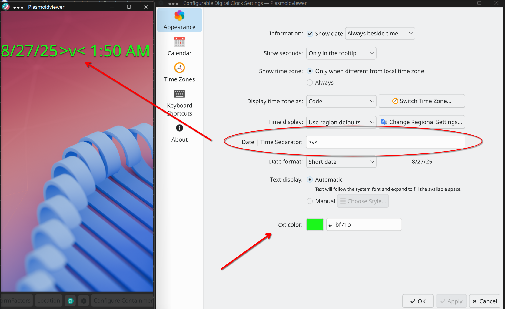

# Plasma Colorful Digital Clock

A **Digital Clock widget for KDE Plasma 6** with additional customization options.

## Example


## Fork
This widget is a fork of the official KDE Digital Clock plasmoid  
[`org.kde.plasma.digitalclock`](https://github.com/KDE/plasma-workspace/tree/master/applets/digital-clock).


## ✨ Features

Compared to the default KDE Digital Clock, this fork adds:

- 🎨 **Clock text color picker** – choose your preferred color for the clock.
- ⏳ **Custom Separator for Date ↔ Time** (in one-line appearance)  
  - Use any symbol or text as a separator.  
  - Leave empty if you don’t want a separator at all.



## 🔧 Installation

### Option 1: Install from KDE Interface (Recommended)

You can install the widget directly through the Plasma interface:

1. Right-click on the desktop or panel and choose **Add Widgets**.
2. In the widget panel, click **Get New...** → **Download New Plasma Widgets**.
3. Search for **Colorful Digital Clock**.
4. Click **Install**.
4. Add `Colorful Digital Clock` to your panel from the widgets menu, as usual.

### Option 2: Manual Installation

1. Download latest `*.plasmoid` file of **Colorful Digital Clock** from either [KDE Store](https://store.kde.org/p/2316062) or [GitHub Releases](https://github.com/v-n7k/plasma-panel-digital-clock/releases)
2. Create the plasmoids folder if it doesn’t exist:
```bash
mkdir -p ~/.local/share/plasma/plasmoids
```
3. Install the plasmoid:
```bash
kpackagetool6 --type Plasma/Applet --install ~/PATH/TO/DOWNLOADED/co.n7k.plasma.digitalclock.plasmoid
```
(Use --upgrade instead of --install if you are updating.)

4. (OPTIONAL) Restart Plasma shell to load the new widget:
```bash
kquitapp6 plasmashell && kstart6 plasmashell
```

5. Add `Colorful Digital Clock` to your panel from the widgets menu, as usual.

### Option 3: Installation from Source code (NOT Recommended)

1. Download or clone this repository.
```bash
git clone https://github.com/v-n7k/plasma-panel-digital-clock.git
```
2. `cd` inside
```bash
cd plasma-panel-digital-clock
```
3. Create the plasmoids folder for the widget:
```bash
mkdir -p ~/.local/share/plasma/plasmoids/co.n7k.plasma.digitalclock
```
4. Copy content of `package` folder to the palsma widgets folder
```bash
cp -r package/. ~/.local/share/plasma/plasmoids/co.n7k.plasma.digitalclock/
```
5. Restart Plasma shell to load the new widget:
```bash
kquitapp6 plasmashell && kstart6 plasmashell
```
6. Add `Colorful Digital Clock` to your panel from the widgets menu, as usual.

## 🛠 Development & Contributions

### 💡Feedbacks
  - Issues, suggestions, and requests for new customizations are welcome.
  - Please use the [Github Issue Tracker](https://github.com/v-n7k/plasma-panel-digital-clock/issues) for that
.

### 🔄 Updates

This widget will be updated in sync with upstream changes in the original
KDE Digital Clock plasmoid
.

### 📜 License

This project follows the same license as the upstream KDE Digital Clock plasmoid. See the LICENSE file for details.